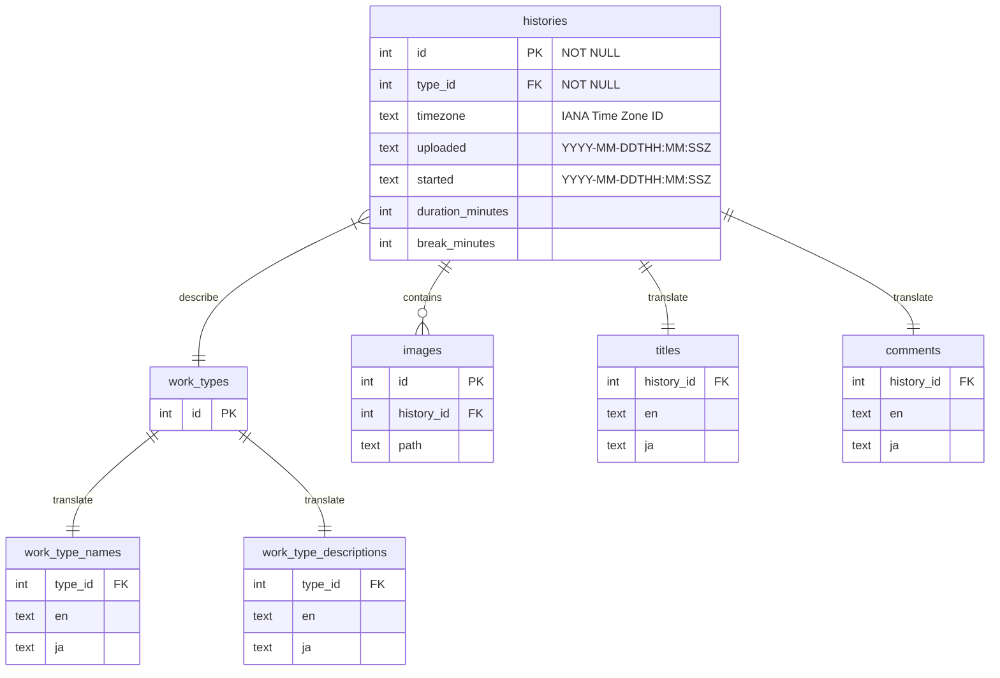

```mermaid
erDiagram
    histories }|--|| work_types : describe
    histories ||--o{ images : contains
    histories ||--|| titles : translate
    histories ||--|| comments : translate
    histories {
        int id PK "NOT NULL"
        int type_id FK "NOT NULL"
        text timezone "IANA Time Zone ID"
        text uploaded "YYYY-MM-DDTHH:MM:SSZ"
        text started "YYYY-MM-DDTHH:MM:SSZ"
        int duration_minutes
        int break_minutes
    }

    titles {
        int history_id FK
        text en
        text ja
    }

    comments {
        int history_id FK
        text en
        text ja
    }

    images {
        int id PK
        int history_id FK
        text path
    }

    work_types ||--|| work_type_names: translate
    work_types ||--|| work_type_descriptions : translate
    work_types {
        int id PK
    }

    work_type_names {
        int type_id FK
        text en
        text ja
    }

    work_type_descriptions {
        int type_id FK
        text en
        text ja
    }
```
