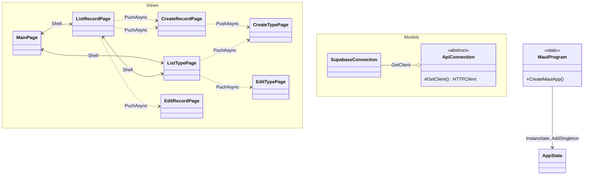

```mermaid
classDiagram
	namespace Views {
		class MainPage {
			
		}
		

		class CreateRecordPage {

		}

		class CreateTypePage {
			
		}

		class ListRecordPage {

		}

		class EditRecordPage {
		
		}

		class ListTypePage {

		}

		class EditTypePage {
		
		}
	}
	MainPage <--> ListRecordPage : Shell
	MainPage <--> ListTypePage : Shell
	ListRecordPage <--> ListTypePage : Shell
	CreateRecordPage ..> CreateTypePage : PushAsync
	ListRecordPage ..> EditRecordPage : PuchAsync
	ListTypePage ..> EditTypePage : PuchAsync
	ListTypePage ..> CreateTypePage : PuchAsync
	ListRecordPage ..> CreateRecordPage : PuchAsync
	ListRecordPage ..> CreateRecordPage : PuchAsync

	namespace Models {
		class SupabaseConnection {

		}

		class ApiConnection {
			<<abstruct>>
			#GetClient() HTTPClient
		}
	}
	SupabaseConnection --o ApiConnection : GetClient

	class MauiProgram {
		<<static>>
		+CreateMauiApp()
	}
	MauiProgram --> AppState : Instanctiate, AddSingleton

	class AppState {
		
	}

```