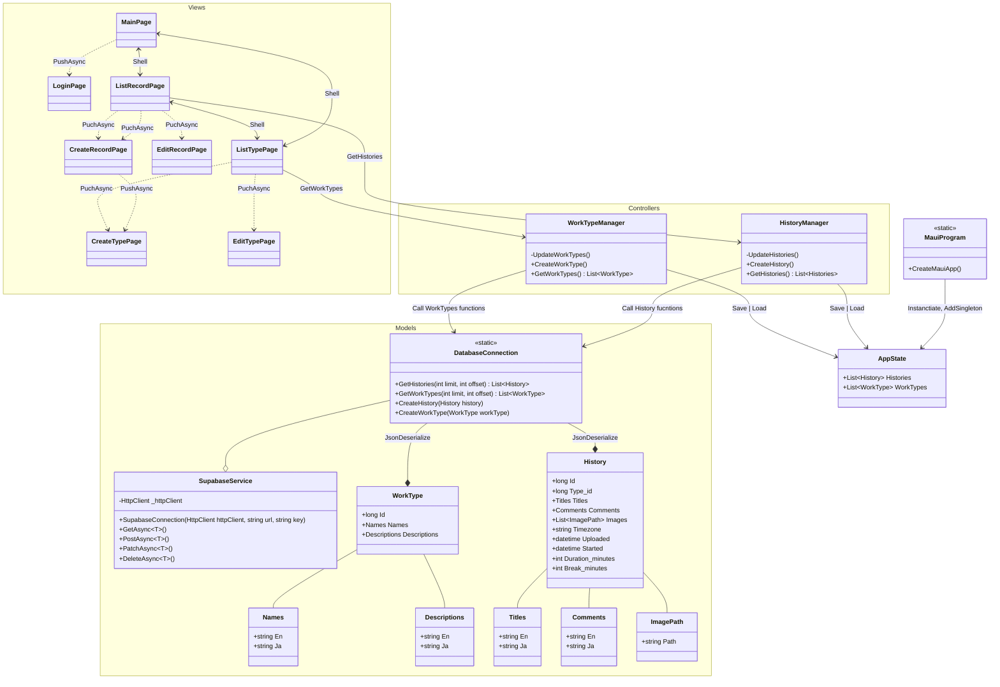

```mermaid
classDiagram
	class MauiProgram {
		<<static>>
		+CreateMauiApp()
	}
	MauiProgram --> AppState : Instanctiate, AddSingleton

	class AppState {
		+List~History~ Histories
		+List~WorkType~ WorkTypes
	}

	namespace Views {
		class MainPage {
			
		}

		class LoginPage {

		}
		

		class CreateRecordPage {

		}

		class CreateTypePage {
			
		}

		class ListRecordPage {

		}

		class EditRecordPage {
		
		}

		class ListTypePage {

		}

		class EditTypePage {
		
		}
	}
	MainPage <--> ListRecordPage : Shell
	MainPage <--> ListTypePage : Shell
	ListRecordPage <--> ListTypePage : Shell
	MainPage ..> LoginPage : PushAsync
	CreateRecordPage ..> CreateTypePage : PushAsync
	ListRecordPage ..> EditRecordPage : PuchAsync
	ListTypePage ..> EditTypePage : PuchAsync
	ListTypePage ..> CreateTypePage : PuchAsync
	ListRecordPage ..> CreateRecordPage : PuchAsync
	ListRecordPage ..> CreateRecordPage : PuchAsync
	ListRecordPage --> HistoryManager : GetHistories
	ListTypePage --> WorkTypeManager : GetWorkTypes

	namespace Controllers {
		class HistoryManager {
			-UpdateHistories()
			+CreateHistory()
			+GetHistories() List~Histories~
		}

		class WorkTypeManager {
			-UpdateWorkTypes()
			+CreateWorkType()
			+GetWorkTypes() List~WorkType~
		}
	}
	HistoryManager --> DatabaseConnection : Call History fucntions
	HistoryManager --> AppState : Save | Load
	WorkTypeManager --> DatabaseConnection : Call WorkTypes functions
	WorkTypeManager --> AppState : Save | Load

	namespace Models {
		class DatabaseConnection {
			<<static>>
			+GetHistories(int limit, int offset) List~History~
			+GetWorkTypes(int limit, int offset) List~WorkType~
			+CreateHistory(History history)
			+CreateWorkType(WorkType workType)
		}

		class SupabaseService {			
			-HttpClient _httpClient
			+SupabaseConnection(HttpClient httpClient, string url, string key)
			+GetAsync~T~()
			+PostAsync~T~()
			+PatchAsync~T~()
			+DeleteAsync~T~()
		}

		class WorkType {
			+long Id
			+Names Names
			+Descriptions Descriptions
		}

		class Names {
			+string En
			+string Ja
		}

		class Descriptions {
			+string En
			+string Ja
		}
		
		class History {
			+long Id
			+long Type_id
			+Titles Titles
			+Comments Comments
			+List~ImagePath~ Images
			+string Timezone
			+datetime Uploaded
			+datetime Started
			+int Duration_minutes
			+int Break_minutes
		}

		class Titles {
			+string En
			+string Ja
		}

		class Comments {
			+string En
			+string Ja
		}

		class ImagePath {
			+string Path
		}
	}
	DatabaseConnection --o SupabaseService
	DatabaseConnection --* History : JsonDeserialize
	DatabaseConnection --* WorkType : JsonDeserialize
	WorkType -- Names
	WorkType -- Descriptions
	History -- Titles
	History -- Comments
	History -- ImagePath
```